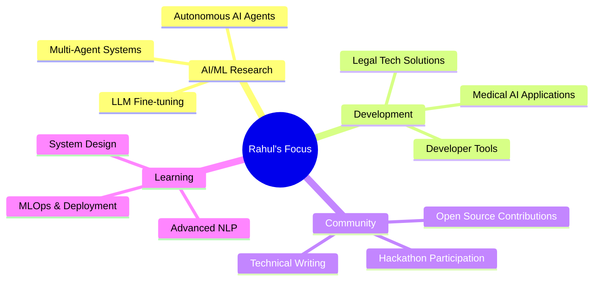

<div align="center">

# 👋 Hello, I'm Rahul Samedavar

### AI/ML Engineer | 7x Hackathon Winner | Multi-Agent Systems Specialist

[](https://git.io/typing-svg)

[](https://www.linkedin.com/in/rahul-samedavar-aa3237293/)
[](https://huggingface.co/Rahul-Samedavar)
[](https://devpost.com/rahulsamedavar)
[](mailto:rahulsamedavar@gmail.com)
<!-- [](https://yourportfolio.com) -->

</div>

---

## 🚀 About Me

```python
class RahulSamedavar:
    def __init__(self):
        self.username = "rahulsamedavar"
        self.location = "Belagavi, Karnataka, India"
        self.education = "KLS Gogte Institute of Technology"
        self.role = "AI/ML & NLP Engineer"
        self.achievements = ["7x Hackathon Winner", "Multi-Agent Systems Expert"]
        
    def current_focus(self):
        return [
            "🤖 Building Autonomous AI Agents",
            "⚖️ Legal Tech & Document Intelligence",
            "🏥 Medical AI Applications",
            "🛠️ Developer Productivity Tools",
            "🌐 Multi-Agent System Architectures"
        ]
    
    def tech_stack(self):
        return {
            "languages": ["Python", "JavaScript", "SQL"],
            "ai_ml": ["GPT-4", "Google Gemini", "PyTorch", "TensorFlow", "Hugging Face"],
            "web": ["FastAPI", "Flask", "React", "Next.js"],
            "tools": ["Selenium", "Docker", "Git", "GitHub Actions"],
            "specialization": ["NLP", "Computer Vision", "Multi-Agent Systems"]
        }
```

<div align="center">

### 🏆 Hackathon Achievements

| 🥇 First Place | 🥈 Second Place | 🥉 Third Place | 🏅 Total Wins |
|:---:|:---:|:---:|:---:|
| **2** | **1** | **1** | **7+** |

</div>

---

## 🎯 Recent Victories

<table>
<tr>
<td width="50%">

### 🥇 GPT-4 Solvathon Winner
**IEEE CS, KLS GIT**
- Project: JustiFy AI Legal Advisor
- Team: DevBytes
- Achievement: Innovative GPT-4 legal solution

</td>
<td width="50%">

### 🥉 FantomCode '25 (3rd Place)
**RVITM Bangalore**
- Project: GitGriffin Spam Detection
- Competition: 150+ teams → 21 finalists
- Duration: 24-hour national hackathon

</td>
</tr>
<tr>
<td width="50%">

### 🥈 Code Relay Showdown
**2nd Place**
- Team: Rahul Samedavar & Aditya Singh
- Focus: Competitive Programming Excellence

</td>
<td width="50%">

### 🏅 DocXpert Genesis AI
**Winner**
- Project: AI Document Analysis System
- Category: AI/ML Applications

</td>
</tr>
</table>

---

## 💻 Featured Projects

<details open>
<summary><b>🔨 Taskion - Autonomous AI Development Agent</b></summary>
<br>

> An intelligent coding assistant that autonomously browses the web, generates code, and manages GitHub workflows.

**✨ Key Features:**
- ⚡ Autonomous web navigation using Selenium
- 🧠 AI-powered code generation with Google Gemini
- 🔒 Sandboxed code execution environment
- 🔄 Automated Git integration and repository management
- 📊 Real-time streaming UI for decision transparency

**🛠️ Tech Stack:** 


[🔗 View Project](https://github.com/yourusername/taskion)

</details>

<details>
<summary><b>⚖️ JustiFy - AI-Powered Legal Document Analyzer</b> 🥇 <i>GPT-4 Solvathon Winner</i></summary>
<br>

> Making Indian law accessible to everyone through AI-powered analysis and multi-agent debate systems.

**✨ Key Features:**
- 💬 Legal Q&A aligned with Indian law
- 🤝 Multi-agent debate system (5 specialized legal agents)
- 📄 Comprehensive document analysis with severity scoring
- ✍️ Automated legal document drafting
- 🔍 Context-aware chat support with conversation continuity

**🛠️ Tech Stack:** 


[🔗 View Project](https://github.com/yourusername/justify)

</details>

<details>
<summary><b>🦅 GitGriffin - GitHub Spam Detection System</b> 🥉 <i>FantomCode '25</i></summary>
<br>

> Intelligent multi-agent system for detecting and preventing spam on GitHub repositories.

**✨ Key Features:**
- 🛡️ Lightweight GitHub Action for automated spam detection
- 🤖 Multi-agent AI approach for accurate classification
- 💻 Desktop application for repository management
- ⚡ React-based frontend with real-time monitoring
- 🎯 Advanced pattern recognition and behavioral analysis

**🛠️ Tech Stack:** 


[🔗 View Project](https://github.com/yourusername/gitgriffin)

</details>

<details>
<summary><b>📚 ShastraDocs-2 - Intelligent Document Processing Platform</b></summary>
<br>

> Advanced document analysis and processing system powered by AI for comprehensive document understanding.

**✨ Key Features:**
- 📄 Multi-format document support and analysis
- 🔍 Intelligent content extraction and summarization
- 🤖 AI-powered insights and key information retrieval
- 📊 Document classification and categorization
- 💾 Efficient document management workflow

**🛠️ Tech Stack:** 


[🔗 View Project](https://github.com/yourusername/shastradocs-2)

</details>

<details>
<summary><b>📝 CodeScribe - Automated Documentation Generator</b></summary>
<br>

> Intelligent documentation tool that automatically generates comprehensive documentation for Python projects.

**✨ Key Features:**
- 📦 Dual input modes: .zip uploads and GitHub integration
- 🤖 AI-generated reStructuredText formatted docstrings
- 🌳 Context-aware dependency graph building
- 📖 Recursive README.md generation for all directories
- 🔄 Seamless Git workflow with automated commits

**🛠️ Tech Stack:** 


[🔗 View Project](https://github.com/yourusername/codescribe)

</details>

<details>
<summary><b>🎨 Code Canvas - Interactive Code Visualization Tool</b></summary>
<br>

> Visual programming environment that transforms code into interactive, understandable diagrams.

**✨ Key Features:**
- 🖼️ Real-time code visualization and flow diagrams
- 🔄 Interactive code execution and debugging
- 📊 Visual representation of data structures and algorithms
- 🎯 Educational tool for learning programming concepts
- ✨ Intuitive drag-and-drop interface

**🛠️ Tech Stack:** 


[🔗 View Project](https://github.com/yourusername/code-canvas)

</details>

<details>
<summary><b>🧠 Brain Tumor Detection CTM - Medical AI System</b></summary>
<br>

> Medical AI system using Contiguous Thought Machine for accurate brain tumor detection and classification.

**✨ Key Features:**
- 🏥 MRI image analysis and classification
- 📈 Complete training pipeline with visualization
- 🎯 High-accuracy tumor detection and classification
- 📊 Comprehensive documentation and Jupyter notebooks

**🛠️ Tech Stack:** 


[🔗 View Project](https://github.com/yourusername/brain-tumor-ctm)

</details>

---

## 🛠️ Technical Arsenal

<div align="center">

### Languages & Frameworks


### AI/ML & Data Science


### Tools & Platforms


</div>

---

## 📊 GitHub Analytics

<div align="center">
  
  
</div>

<div align="center">
  
</div>

<div align="center">
  
</div>

---

## 🏅 Achievements & Badges

<div align="center">

[](https://github.com/ryo-ma/github-profile-trophy)

</div>

---

## 📈 Contribution Stats

<div align="center">


</div>

---

## 🎯 Current Focus & Learning



---

## 💼 Professional Highlights

<table>
<tr>
<td width="33%" align="center">

### 🎓 Education
**KLS Gogte Institute of Technology**  
AI/ML & NLP Engineering  
Belagavi, Karnataka

</td>
<td width="33%" align="center">

### 🏆 Achievements
**7x Hackathon Winner**  
Multiple 1st & podium finishes  
National-level competitions

</td>
<td width="33%" align="center">

### 🌟 Specialization
**Multi-Agent AI Systems**  
Legal Tech & Medical AI  
Developer Productivity Tools

</td>
</tr>
</table>

---

## 🤝 Let's Collaborate!

I'm passionate about working on innovative AI/ML projects, especially in:

<div align="center">

| Domain | Interest Areas |
|:------:|:--------------|
| 🤖 **AI Agents** | Autonomous systems, Multi-agent architectures, LLM applications |
| ⚖️ **Legal Tech** | Document intelligence, Legal AI, Compliance automation |
| 🏥 **Medical AI** | Diagnostic systems, Medical imaging, Healthcare automation |
| 🛠️ **Dev Tools** | Productivity tools, Code automation, Documentation systems |
| 🌐 **Open Source** | Contributing to impactful projects, Community building |

</div>

---

## 📫 Get in Touch

<div align="center">

### Let's build something amazing together! 🚀

[](https://linkedin.com/in/rahul-samedavar)
[](https://huggingface.co/rahulsamedavar)
[](https://devpost.com/rahulsamedavar)
[](mailto:your.email@example.com)

### 💬 Open to:
✅ Collaboration on AI/ML Projects | ✅ Hackathon Teams | ✅ Open Source Contributions  
✅ Research Opportunities | ✅ Technical Discussions | ✅ Mentorship

---


**⭐️ From [rahulsamedavar](https://github.com/yourusername) | Built with 💙 and ☕️**

*"Building AI systems that make a difference, one project at a time."*

</div>